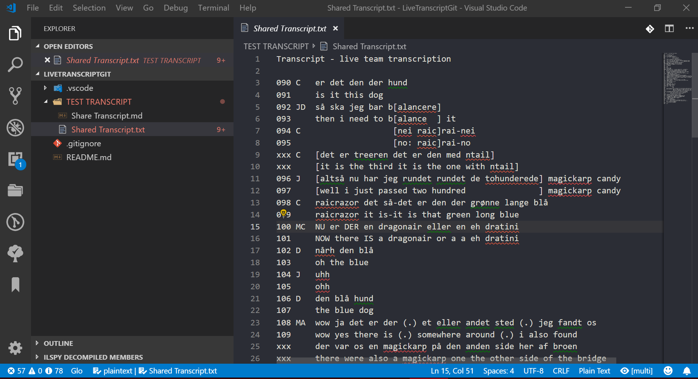
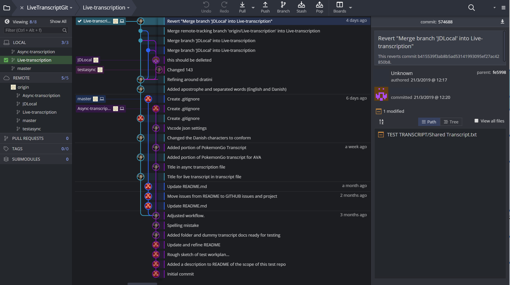
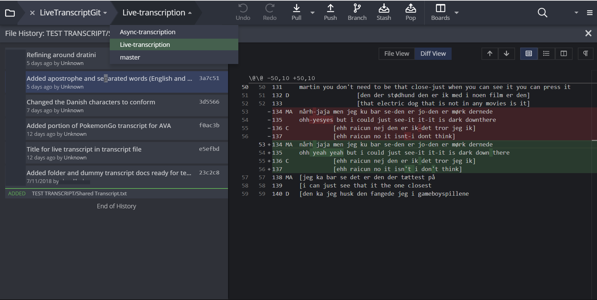
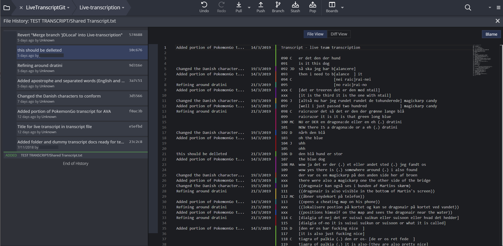

---
author-meta:
- Paul McIlvenny
bibliography:
- content/manual-references.json
date-meta: '2020-10-22'
header-includes: "<!--\nManubot generated metadata rendered from header-includes-template.html.\nSuggest improvements at https://github.com/manubot/manubot/blob/master/manubot/process/header-includes-template.html\n-->\n<meta name=\"dc.format\" content=\"text/html\" />\n<meta name=\"dc.title\" content=\"New Technology and Tools to Enhance Collaborative Video Analysis in Live \u2018Data Sessions\u2019\" />\n<meta name=\"citation_title\" content=\"New Technology and Tools to Enhance Collaborative Video Analysis in Live \u2018Data Sessions\u2019\" />\n<meta property=\"og:title\" content=\"New Technology and Tools to Enhance Collaborative Video Analysis in Live \u2018Data Sessions\u2019\" />\n<meta property=\"twitter:title\" content=\"New Technology and Tools to Enhance Collaborative Video Analysis in Live \u2018Data Sessions\u2019\" />\n<meta name=\"dc.date\" content=\"2020-10-22\" />\n<meta name=\"citation_publication_date\" content=\"2020-10-22\" />\n<meta name=\"dc.language\" content=\"en-GB\" />\n<meta name=\"citation_language\" content=\"en-GB\" />\n<meta name=\"dc.relation.ispartof\" content=\"Manubot\" />\n<meta name=\"dc.publisher\" content=\"Manubot\" />\n<meta name=\"citation_journal_title\" content=\"Manubot\" />\n<meta name=\"citation_technical_report_institution\" content=\"Manubot\" />\n<meta name=\"citation_author\" content=\"Paul McIlvenny\" />\n<meta name=\"citation_author_institution\" content=\"Department of Culture &amp; Learning, Aalborg University\" />\n<meta name=\"citation_author_institution\" content=\"Centre for Discourses in Transition (C-DiT)\" />\n<meta name=\"citation_author_institution\" content=\"Video Research Lab (VILA)\" />\n<meta name=\"citation_author_orcid\" content=\"0000-0003-2327-2124\" />\n<link rel=\"canonical\" href=\"https://QUIVIRR.github.io/Enhanced-Data-Sessions/\" />\n<meta property=\"og:url\" content=\"https://QUIVIRR.github.io/Enhanced-Data-Sessions/\" />\n<meta property=\"twitter:url\" content=\"https://QUIVIRR.github.io/Enhanced-Data-Sessions/\" />\n<meta name=\"citation_fulltext_html_url\" content=\"https://QUIVIRR.github.io/Enhanced-Data-Sessions/\" />\n<meta name=\"citation_pdf_url\" content=\"https://QUIVIRR.github.io/Enhanced-Data-Sessions/manuscript.pdf\" />\n<link rel=\"alternate\" type=\"application/pdf\" href=\"https://QUIVIRR.github.io/Enhanced-Data-Sessions/manuscript.pdf\" />\n<link rel=\"alternate\" type=\"text/html\" href=\"https://QUIVIRR.github.io/Enhanced-Data-Sessions/v/b7c95aaaf0f6013805a373859ec2181ad70b08af/\" />\n<meta name=\"manubot_html_url_versioned\" content=\"https://QUIVIRR.github.io/Enhanced-Data-Sessions/v/b7c95aaaf0f6013805a373859ec2181ad70b08af/\" />\n<meta name=\"manubot_pdf_url_versioned\" content=\"https://QUIVIRR.github.io/Enhanced-Data-Sessions/v/b7c95aaaf0f6013805a373859ec2181ad70b08af/manuscript.pdf\" />\n<meta property=\"og:type\" content=\"article\" />\n<meta property=\"twitter:card\" content=\"summary_large_image\" />\n<link rel=\"icon\" type=\"image/png\" sizes=\"192x192\" href=\"https://manubot.org/favicon-192x192.png\" />\n<link rel=\"mask-icon\" href=\"https://manubot.org/safari-pinned-tab.svg\" color=\"#ad1457\" />\n<meta name=\"theme-color\" content=\"#ad1457\" />\n<!-- end Manubot generated metadata -->"
keywords:
- data session
- ethnomethodological conversation analysis
- audio-visual technology
- qualitative research
- digital humanities
- immersive qualitative analytics
- virtual reality
lang: en-GB
manubot-clear-requests-cache: false
manubot-output-bibliography: output/references.json
manubot-output-citekeys: output/citations.tsv
manubot-requests-cache-path: ci/cache/requests-cache
title: "New Technology and Tools to Enhance Collaborative Video Analysis in Live \u2018Data Sessions\u2019"
...

<small><em>
This manuscript
([permalink](https://QUIVIRR.github.io/Enhanced-Data-Sessions/v/b7c95aaaf0f6013805a373859ec2181ad70b08af/))
was automatically generated
from [QUIVIRR/Enhanced-Data-Sessions@b7c95aa](https://github.com/QUIVIRR/Enhanced-Data-Sessions/tree/b7c95aaaf0f6013805a373859ec2181ad70b08af)
on October 22, 2020.
</em></small>

## Authors {.unnumbered}

+ **Paul McIlvenny** 
    {.inline_icon}
    [0000-0003-2327-2124](https://orcid.org/0000-0003-2327-2124)
    · {.inline_icon}
    [skandilocks](https://github.com/skandilocks) 
  <small>
     Department of Culture & Learning, Aalborg University; Centre for Discourses in Transition (C-DiT); Video Research Lab (VILA)
  </small>

## Abstract {.unnumbered}

The live ‘data session’ is arguably a significant collaborative practice amongst a group of co-present colleagues that has sustained the fermentation of emerging analyses of interactional phenomena in ethnomethodological conversation analysis for several decades. 
There has not, however, been much in the way of technological innovation since its inception. 
In this article, I outline how the data session can be enhanced (a) by using simple technologies to support the ‘silent data session’, (b) by developing software tools to present, navigate and collaborate on new types of video data in novel ways using immersive virtual reality technologies, and (c) by supporting distributed version control to nurture the freedom and safety to collaborate synchronously and asynchronously on the revision of a common transcript used in a live data session. 
Examples of real cases, technical solutions and best practices are given based on experience. 
The advantages and limitations of these significant enhancements are discussed in methodological terms with an eye to future developments.

### Keywords {.unnumbered}

Data session, Ethnomethodological conversation analysis, Audio-visual technology, Qualitative research, Digital humanities, Immersive qualitative analytics, Virtual reality

## Introduction {.page_break_before}

At the risk of overgeneralising, many scholars working today in ethnomethodological conversation analysis (EMCA) and comparable qualitative approaches to video data [@knoblauch2008; @schnettler2008] rely on trusty software applications such as familiar word processors and standard digital media players on the computer desktop when they work with their video data.
They do this for a variety of understandable reasons, including a lack of technical competence, a lock-in to generalised desktop word processing tools, a frustration with the complexity of specialised software and the paucity of easily re-usable features.
With new types of video data, e.g. 360-degree video and spatial audio, there are good reasons why this situation may have to change [@mcilvenny2019].[^360]
My argument is not about transcription software or video players per se; instead, it shifts attention to repurposing technology and developing software to support and enhance the collaborative analysis of video data within a paradigm advanced since 2016 called *Big Video* [@Nordicom2017; @davidsen2016].
Moreover, my specific focus is the genre of the live ‘data session’. This is arguably a significant collaborative practice amongst a group of co-present colleagues that has sustained the fermentation of emerging analyses of interactional phenomena in EMCA for several decades [@antaki2008; @stevanovic2017; @tutt2011; @fraser2005; @harris2012].
The genre has regional and national variations, but for the most part it has been structured around a group of colleagues replaying an analogue or digital video on a flat TV or projection screen while referring to a static paper transcript.
There has not, however, been much technological innovation over the course of its history [@evers2011], and some early positive features – e.g. equal participation, a collaborative space for brainstorming – may have been lost or mislaid.[^opendata]
Thus, the time is ripe for more experimentation [@laurier2019; @mondada2019; @Nordicom2017].
The diagram in Figure {@fig:image1} maps out a much simplified linear workflow in which the data session has its place, with an indication of the roles of some technologies and software tools to enhance the data session that I elaborate on below.

.](images/image1.png){#fig:image1}

After outlining the distinctive features of the classic data session and considering prior studies of how data sessions are organized socially, I describe how the data session can be enhanced (a) by using simple technologies to support the ‘silent data session’, (b) by developing software tools to present, navigate and collaborate on new types of video data in novel ways using immersive virtual reality technologies, and (c) by supporting distributed version control to nurture the freedom and safety to collaborate synchronously and asynchronously on the revision of a common transcript used in a live data session.
It is not my intention in this article to discuss and analyse how analysts actually undertake (enhanced) data sessions as a social practice.
Instead, I consider several practical issues, all centred around recommendations concerning how to support and enhance the traditional collaborative data session.
These are:

1. *Flexibility* of how one can view and listen to the video data presented.

2. Ability to view 2D and *360-degree* video footage *together*.

3. Ability to hear stereo and *spatial* audio.

4. Ability to *cooperatively* revise a transcript record.

5. Ability to *collaboratively* annotate the video.

6. Coordination between co-analysts who are *not* physically co-present.

7. A detailed, robust *archive* of past changes and *attribution* of responsibility.

I give examples of real cases, technical solutions and best practices based on experience, and I discuss the advantages and limitations of these significant enhancements in methodological terms with an eye to future developments.
I present possible technological solutions and their methodological import based on my experiences developing and testing such solutions locally with the help of colleagues and the *BigSoftVideo* software development team at Aalborg University.
Combining virtual reality (VR) technology and game engines with 360-degree cameras and ambisonic microphones has led the *BigSoftVideo* team to develop an **Immersive Qualitative Analytics** (IQA) toolkit.
The aim of the toolkit is to embed, annotate and manipulate layers of mixed video in order for qualitative researchers (for example, in data sessions) to better visualise, analyse, share and archive complex sites and scenes of sociocultural interaction, communication and performance, as I demonstrate below.

## What is a ‘data session’?

Since the early days of EMCA in the 1970s, the ‘data session’ genre has been an integral component of how scholars can gain important feedback and fresh ideas on their own video (or audio) data, how they collaborate on a pre-analysis of someone else’s data, and how newcomers learn how to do EMCA in practice by watching others and taking part themselves.
One of the key epiphanies of a data session, noted by @schegloff1999 [: 578], is that “anyone who has participated in CA ‘data sessions’ or so-called ‘play groups’ – analytic jam sessions, if you like – which have ‘taken off’ will recognize what I am talking about, and know the reality of such unmotivated observations and how they can set off a line of inquiry which has no precedent in the experience or past work of the participants.”

### The classic data session

Based on my experience over the years and on local experiments with the data session format,[^datasessionURL] and at the risk of being contentious or too normative, here is my attempt to define the key elements of a ‘good’ data session:

1. A data session usually has a presenter (or data-holder) who brings (edited/anonymised) video data to play to the other participants, within ethical constraints.

2. A transcript in some recognisable format (e.g. Jeffersonian, Mondadian, score-based) is usually handed out on paper to the participants [@hepburn2017; @mondada2018].
Other materials may be distributed or presented, such as screenshots, photos and diagrams [@laurier2014; @laurier2019].

3. A period of acclimatisation is needed, in which the video is replayed many times. Clarifications of the transcript and the setting may be requested to find a common understanding and a ‘correct’ version of the transcript agreed upon by the group.

4. Often a particular section of the transcript is selected to focus the work of the group.

5. A timed period of personal reflection follows in which the participants work alone and silently on the transcript to locate an interesting phenomenon, to identify a ‘noticing’ and/or to produce an analytic observation to present in the next phase.
Traditionally, the video is *not* played in this phase because it is disturbing.
This phase may last from 10-15 minutes.

6. There follows a period of interchange between participants, which may take the form of (a) freeform contributions from anyone who wishes to speak up and take the floor, often leading to group discussion, *or* (b) a common focus in which the video is played until someone announces a phenomenon of interest and discussion centres around that, *or* (c) a democratic round in which each participant gets a turn to speak freely or pass.
The data-holder is always the last in the round and reserves comment until this time.
Each person who takes a turn should present one proto-analysis or observation.

7. Comments on the data can be informal, but they should be anchored in the data, often tied to the transcript, and not ‘take sides’ nor draw upon prior descriptions or external or stereotypical knowledge.
The spirit of ‘unmotivated looking’ is encouraged.

8. A common rule is that direct criticism of each other’s comments is not permitted.
Guidance may be given if a participant disregards points 6), 7) or 8).

9. A summing up is optional, and is usually led by the data-holder.

10. Written notes by participants on the transcript may be returned to the data-holder if requested.

The data session genre is neither unique nor particular to EMCA.
It has been deployed for non-audio-visual data as well as for a data-holder who does not aspire to an EMCA approach.[^predatasession] Thus, the enhancement of the general data session genre has potential benefits for a broader audience of qualitative researchers.
There are definitely some aspects of a ‘good’ data session that can be supported by technical solutions; other problems that need solutions may have more to do with the personalities of the participants and the specific social organisation of the event within an institutional context.

There is a small literature analysing data sessions from an EMCA perspective [@antaki2008; @stevanovic2017; @tutt2011; @fraser2005; @harris2012].
They focus on matters such as the moral judgements made by participants, the re-enactments of the body movements observed in the video, and the pedagogical role of data sessions and the socialisation of new members into its practices.
Besides @fraser2005, to which I will return later, there is very little mention of the practices of playback – review, rewind, pause – in relation to the technical transport controls of the video player/screen.
If they focus on the data session itself, then they are preoccupied by talk in progress while the video is paused.
It is only talk and gesture that is transcribed.
On occasion @tutt2011 do note that the video was playing in slow motion (227) or was replaying (230), but most examples are based on talk centred around a paused video screen.[^videoplayback] Since all but one of these articles topicalise only the accomplishment of the data session as a social encounter, there is very little in the way of recommendations of how to improve or enhance the data session.
Note that one article is particularly critical of some of the data sessions they studied and the potential they have to reproduce power relations in institutions.
Unfortunately, this danger is likely to remain a concern even when technology is used to enhance the data session.

## Current solutions

In regard to taking first steps to enhance the data session, there are some currently available solutions and some others that have been prototyped. 
These include higher quality audio-visual devices, better modes of presentation, granting access for remote participants, and bespoke support for distributed embedded action. 
I give a brief overview of some of these solutions, but for the sake of brevity and focus I do not aspire to a thorough review and comparison of all prior and legacy solutions to collaborative video analysis.

A straightforward, but often neglected, step that can be taken to enhance data sessions is to improve the quality of the video and audio that is presented to the participants, and to give more individual control over, for example, sound quality.
If the participants are sitting around a table and viewing a TV monitor or the image from a projector/beamer on a screen, then there can be serious reductions in the quality of the video image, e.g. poor contrast and brightness, low resolution and washed out colours.
A high-quality 4K/UHD (or even an 8K) large monitor/TV would obviously help matters, but even so there can be limitations when viewing 360-degree data (see *AVA360VR* below).
Furthermore, the audio is often audible from small TV speakers or distant wall-mounted general-purpose speakers.
The audio quality is often poor, and the audio level is not adjustable to match individual preference, e.g. one may be hard-of-hearing or at the back of a room with poor acoustics.
A reliable solution can be found from an unusual source as described below.

Some of the well-known transcription software tools available do have some features that could be useful in a data session. 
For instance, the free *CLAN* software for transcription, coding and analysis supports a web HTML interface for playback of a transcript in a browser, known as “Browsable Watch”.[^clan]
The commercial *TRANSANA* software [@woods2011] also supports a “Presentation Mode” that plays a video while automatically scrolling through the time-coded transcript segment by segment.[^transana]
Both of these features enable a data-holder to play a video while automatically scrolling through a mutually accessible digital transcript that everyone may also have in printed form. 
These ‘presentational’ features of desktop transcription software solutions can be easily re-presented virtually and developed further in virtual reality environments, such as in *AVA360VR* described below.

Vanilla video conferencing over the Internet has been possible since the 1990s [@barabesi1997; @meier1998; @meier2003; @raudaskoski2000]. 
With increasing resolution and computing power, video conference software can be run from a laptop or a smartphone to give some sense of visual telepresence [@licoppe2012].
When used in a remote data session, it permits participants to take a more spectatorial position in relation to the presentation of video data and the commentary and discussion that ensues.[^RDS]
Nowadays, 360-degree video conferencing is possible with the appropriate bandwidth and seating arrangement, e.g. *Meeting Owl*.[^OWL]

One can also meet with others in the form of an avatar in a collaborative desktop virtual environment, such as *Second Life* [@antonijevic2008; @bardzell2008].
Other novel solutions include that presented by @luff2013.
In their study, scholars at two remote sites used a networked physical arrangement of mixed reality screens called a “t-Room” to collaborate on analysing a Hitchcock film.
Participants at each site were nearly surrounded by 8 HD monitors on which life-sized video images were projected of the participants at the other site blended with video images locally.
As demonstrated below, with virtual reality technology today much of what transpired within the “t-Room” can be simulated in VR in a 360-degree immersive environment such that the expensive physical setup required is unnecessary.

## Next steps to enhance a data session

### Silent data session

After the memorable ‘silent disco’ event at the International Conference on Conversation Analysis (ICCA) in Loughborough in 2018, a set of 24 silent disco headphones, three local FM radio transmitters and two bulk USB chargers (see Figure {@fig:image2}) were purchased at my university specifically to enhance data sessions.[^SilentDisco]
Prior to this purchase, a 16-channel stereo headphone mixer with wired headphones had been used, but this was clumsy with so many criss-crossing wires.
Also, the volume had to be adjusted at the mixer, which was cumbersome.
The silent disco headphones are wireless, and because they use the analogue FM radio band there is no noticeable latency. 
In addition, there is no limit on the number of receivers, unlike WiFi or Bluetooth digital networks that share a single bi-directional bandwidth and thus get congested.
They also have an individual volume control on the side, as well as an internal lithium-ion rechargeable battery that can be charged with a simple USB cable.

{#fig:image2}

This equipment has been repurposed since Autumn 2018 for data sessions.
Locally, they are called ‘silent data sessions’, which have the following features:

1. The silent disco headphones can be used to listen to the standard audio channel in stereo whenever the video is replayed or looped.
The closed-ear headphones give more personal control of the audio levels and some left/right directionality in the stereo image.

2. The timed period of personal reflection can be conducted while the video clip is looped.
Participants using headphones can listen (or not) to the looped clip without disturbing others.

3. A special feature of silent disco, which has been used in some of our local data sessions since 2018, is to broadcast two or three stereo audio channels simultaneously that are synchronised with the video.
This is especially useful if the event was recorded, for example, with several cameras and/or wireless microphones.
Participants can personally select which of the channels they wish to listen to.
For instance, the whole group can switch to a new channel, or an individual choice can be made.
If the distinct recordings from each microphone are mixed into three separate stereo tracks, then each of those tracks can be passed on to a dedicated transmitter which sends the signal on a unique, local FM frequency band.[^Stereo] 
Each headphone has a button to quickly toggle between the three fixed frequency bands, each of which has a specific coloured lighting (e.g. red, green or blue) on the headphone cups (see Figure {@fig:image2}).

4. Given that the silent disco headphones are stereo, and playback of ambisonic spatial audio requires stereo headphones for accurate binaural spatialisation, then it is possible to replay 360-degree video data, if it has a spatial audio track, so that participants hear the sound in the recorded scene with some *directionality*.
For example, if the data-holder plays the 360-degree video and rotates the viewpoint to look somewhere else in the visual field, then the audio that is heard on the headphones will rotate as well, so that the sound is always coming from the same location in the scene.
If a speaker is on the right of the visual field, then they will be heard in the right ear, if the view is rotated 180-degrees so that they are now on the left side of the visual field, then they will be heard in the left ear.
In Figure {@fig:image3}, the setup is shown with data recorded at a seminar on abductive reasoning at an archaeological site.
As indicated on the frame grab from an equirectangular video, the participants in the data session could switch between the audio recorded (i) from a 360-degree camera, (ii) from a 2D camera or (iii) from two mono wireless microphones worn by two participants, while watching the 360-degree video footage.

.](images/image3.png){#fig:image3}

### Showing video data in VR

As discussed above, high-quality projectors and large size 4K televisions are a bonus for data sessions, but they are restrictive if one simply plays 360-degree video recordings from the desktop, especially if it is desirable to juxtapose different video footage recorded at the same time or to annotate the video prior to the data presentation or during the data session itself.
In order to ‘inhabit’ 360-degree video data – that is, to explore complex spatial video and audio recordings of a scene in which social interaction took place through a tangible interface in virtual reality – a fully functional software solution called *AVA360VR* has been developed by the *BigSoftVideo* team at Aalborg University.
@mcilvenny2019 outlines the design and possible analytical use cases of a very early prototype circa January 2018.
It has proven to be very useful for presenting complex Big Video data in conferences and data sessions.

#### AVA360VR

As one key component in our *Immersive Qualitative Analytics* (IQA) toolkit, *AVA360VR* (Annotate, Visualise, Analyse 360 video in Virtual Reality) is designed by qualitative researchers to make it possible to inhabit a single or multiple 360-degree videos, annotate the video footage, share the resulting project, and export new representations of the original 360-degree data in novel ways.[^AVA]
The key features of this tool for data sessions include:

1. The ability of the data-holder to view their data immersively in VR in 360-degrees and simultaneously present it to the other participants in several different formats on a 2D screen, e.g. a large 4K TV monitor.

2. The ability to annotate 360-degree video data with animated line drawings, images, 3D objects, etc. live in a data session.

3. The ability to insert synchronised videos from other cameras recording the event, including other 360-degree cameras, and play them simultaneously for the other participants.
Depending on computing power, storage access speed and resolution, up to 10 independent videos can be inserted and played at the same time.

4. The ability to insert, animate and spatialise localised audio sources recorded in the event, e.g. using lavaliere microphones, which participants in the data session will hear as coming from those visual sources in 360-degrees, e.g. participants’ speaking from that location in the scene.
Depending on computing power, up to 10 independent audio sources can be inserted and played simultaneously.

5. The ability to live mix (mute, volume, solo) any audio source in the scene to bring out a particular hearing based on the distribution of the audio sources relevant to the participants in the data session.

6. The ability to create an editable and saveable comic panel sequence transcript using captions and speech bubbles.

7. The ability to save to disk any recammed video clips, sequences of keyframe images, screenshots, comic transcripts, etc. made in the actual data session for later use, with clear meta-data such as time-code, source, date/time of capture, etc.

8. The ability to play the 360-degree video and synchronise the display of a pre-segmented, enhanced transcript with advanced looping and live editing.

9. The ability to volumetrically capture an analysis event, eg. in a live data session, and reenact it immersively at a later date from any perspective [see @mcilvenny2020].

Another software prototype has been developed, as a second component in the IQA toolkit, to help with the pre-analysis stage when one is faced with a lot of complex data recorded over a longer period involving multiple cameras and microphones.
*SQUIVE* (Staging Qualitative Immersive Virtualisation Engine) helps an analyst reconstruct the site and the scenes in which social interactions took place over time in an interactive and immersive 3D representation or model in virtual or augmented reality.[^SQUIVE]
It has been used in a data session to take participants on a tour of an archived site to show where the different events and activities took place spatially [see @mcilvenny2020].
Moreover, the position and footage of different cameras and microphones is staged in the reconstructed space.
The actual 360-degree video footage can be inhabited from within *SQUIVE* using *AVA360VR*, which allows a powerful free-flow between the virtual ‘reconstruction’ and the video ‘real’ without leaving VR.

### Data sessions in VR

In a pioneering project built on the computer architecture available at the time, Fraser *et al.* (2005) reports on the development of a prototype called *MiMeG* to support remote data sessions, including synchronising the playback of a 2D video across two or more sites and sharing freeform annotations [@fraser2006] on a desktop or a screen between sites.
From their description, it appears that the digital transcript texts, however, were only local to each site and not synchronised.
To locate existing work practices that would need to be supported, a preliminary study identified two key issues, namely (i) the problem of sharing and embodying perspectives on the scene depicted in the video, and (ii) the problem of the different configurations and control of technologies of perception.
*MiMeG* was an innovative prototype, but now one can virtualise all its functions in networked, multi-user VR and expand them in ways not possible before.

#### CAVA360VR

In order to further develop an IQA toolkit, a prototype *CAVA360VR* (Collaborate, Annotate, Visualise, Analyse 360-degree video in Virtual Reality) has been built and tested. It is a simplified and modified version of *AVA360VR* suitable for collaboration.[^CAVA]
It is designed to allow up to 20 analysts in different locations around the world to come together simultaneously in an immersive virtual environment to analyse a tangible 360-degree video.
Given the radical changes in our work practices as a consequence of the COVID-19 pandemic in 2020, CAVA360VR offers the possibility to collaborate remotely on analysing complex video data in a more immersive fashion than desktop video conferencing. 
There are two modes of participation: VR and non-VR.
In the VR mode, each person accessing the ‘room’ needs a VR headset (e.g. *HTC VIVE PRO or OCULUS RIFT S* or *HP REVERB*) and an appropriately powerful laptop or desktop computer to run the software (for Windows 10) locally. 
In the non-VR mode, an ordinary PC laptop with Windows 10 will suffice.
In addition, reliable fast Internet access is required.
To minimise latency, the 360-degree video and other media files are stored locally on each computer, so they must be shared beforehand.[^Ethics]

Footage from other cameras that were simultaneously recording the original event should also be shared in advance, so these clips can also be viewed at the same time as the 360-degree video by everyone in the data session.

.](images/image4.png){#fig:image4}

The *CAVA360VR* tool has several powerful features, some of which are derived from earlier solutions, such as *MiMeG*, or are familiar from co-present data sessions:

1. A *CAVA360VR* user hosts a private virtual room that any other user can join if they know the password.

2. Users who join the room arrive in a shared 3D space with a head avatar and two hands that are visible to others co-present in the virtual space (see Figure {@fig:image4}).

3. Users can talk to each other. Users are identified by name tags on their avatars.

4. A common 360-degree video plays for all the users, surrounding them on all sides.

5. Any local user can play and pause the synchronised video for everyone.

6. A visual timeline can be toggled to appear for all users which shows the current frame.
Any user can scrub the video by grabbing the playhead.

7. Every user sees a transient visual ‘smoke’ trail that traces the movement of everyone’s laser pointer up to its current position.

8. Any VR user can draw on the video. Drawings are visible to, and moveable by, all other users (see Figure {@fig:image4}).
However, only creators can delete their own drawings.

9. An image or text, such as a transcript, can be inserted into the scene, which all other uses can see.
It is independently moveable (see Figure {@fig:image4}).

10. Any user can open an additional synchronised 2D video in the scene, which all other users can see.
It is independently moveable (see Figure {@fig:image4}).

11. Any user can open up a ‘mirror cam’ that shows a live view on a specific area of the 360 video, which all other users can see.
It is lockable and independently moveable.

12. Any user can leave the main private virtual room and create or join another room (in break out groups) to focus individually or in smaller groups on developing a proto-analysis of the data-at-hand.

13. For presentations to a larger audience, an individual user can toggle between different views on the data session, e.g. (i) what that user sees (see Figure {@fig:image4}), (ii) an over-the-shoulder shot that is stabilised, and (iii) a third-person shot that shows the group of users/analysts at work.

The prototype has been tested between users in different countries.
For example, *CAVA360VR* was used to hold a live virtual data session at a national research conference in 2019, in which three co-analysts (M, J and P) in VR were collaborating even though they were in three different physical locations across two countries (see Figure {@fig:image4}).
The data that they analysed together involved six participants in a two-team competition to solve a Lego puzzle when only one member in each group could view the hidden Lego construction in order to instruct the others in their team how to rebuild it from a pile of blocks.[^Lego]
A dense composite 2D video clip showing the different screens and audio chat of the three analysts has been uploaded to a public archive.[^ZenodoURL]
The video clip shows the viewport chosen by each of the three analysts and recorded locally.
There are three possible viewports that can be selected by each user: (A) what they each see in their VR HMD (head-mounted display), (B) an over-the-shoulder view (with an outline showing their avatar), and (C) a static third-person view of the three analysts.
Analyst M (seen by P in Figure {@fig:image4}) was at the conference location and always used viewport (B) so that the audience would see a stable view of what M was doing.
There was also an observer present at a fourth location who is connected from a computer in non-VR mode; the observer could watch the analysts and reposition themselves in the scene to find the best viewpoint.[^Sync]
In the video clip, a segment of the live virtual data session is shown in which the original video data clip (Lego data; 1 minute) is replayed (for the third and last time), then M, J and P each present their brief observations on what they found interesting in the data.[^Consent]
In addition to their voice, they each use the shared 360-degree video playback, the shared 2D video, the shared transcript (in two languages) and the shared drawings they create to construct an intelligible virtual commentary on the data.

In January 2020, a new version of *CAVA360VR* was used to enhance a live intercontinental virtual data session between Ghana and Denmark.
A Ghanaian researcher presented their 360-degree video data, recorded at a busy traffic intersection in Northern Ghana, to a local group of researchers in Aalborg.
The Ghanaian researcher used an enhanced non-VR desktop mode, and was present as an avatar able to play and pause the video playback, bring up a timeline, insert a video clip and a map of the area in which the data was collected.
The author was in VR-mode with all the benefits outlined above.[^nonVRmode]
A third person was in observer mode to record the event.
The local participants could see and hear the video data as seen and manipulated by the author in VR.
The audio chat supported in *CAVA360VR* was problematic as a result of the poor local internet service in Ghana, so the audio discussion between Aalborg and Ghana was supplemented by a free, secure Voice-over-IP service over the mobile network (e.g. Signal).
The mixed virtual data session was conducted according to the usual principles over a two hour period.
Several of the data session participants in Aalborg gave their commentary on the data in VR using *CAVA360VR*, while others preferred to talk while the author manipulated the video and the tools to show the phenomena in question.

In May 2020, as a consequence of the COVID-19 pandemic, the latest version of *CAVA360VR* was used in a virtual research workshop (MOBSIN 10: *Advanced European Workshop on Mobilities and Social Interaction*) to live stream a 45-minute data session between five remote participants (working from home in Ghana, Aalborg and Oulu) who were collaborating on the same video data as described above. The live stream was relayed via Blackboard Connect to 30 viewers around Europe.

Our experience with *CAVA360VR* has been very positive. Surprisingly, playing the 360-degree video in *CAVA360VR* while in Virtual Reality feels more immersive than if one was sitting in the same physical room viewing it on a TV screen with the other analysts.
It can be applied, for instance, to training a dispersed group of PhD students how to analyse 360-degree video data in practice.
Moreover, there is definitely a future for rich, focused data sessions in a distributed team without the need for physical travel to the same location.
Such use cases heed the urgent call to find solutions that circumvent air travel because of its substantial impact on climate change or because of travel restrictions resulting from the pandemic.
There are big plans at *BigSoftVideo* for major enhancements and new features to support cooperation and creativity in such multi-user, mixed reality immersive virtual environments.

### What version is this and who is to blame?

There is one set of technical practices that support memory work that has not made much inroad into the work of transcription [@markle2011] and the practices of data sessions and that is version control.
In an ordinary workflow on the desktop, one can store multiple versions and backups of a transcript file, but as soon as a team of people are involved, and there is a long history of changes, it gets more difficult to know which version is active and current, what changes were made by others and who might be to blame for unwanted changes, so they can be repaired.
In addition, it would be useful to develop support for more collaborative ways of making and tracking live changes to a common transcript in a data session.[^openplus]
Luckily, transcript files can be treated like plain text source code in software development, and so they are just as easy to track over time.

Much can be learnt from software developers, who almost always use a version control system.
There are several varieties including *centralised* and *distributed* version control systems.
Version control systems keep a digital record of every granular change made to a file or set of files over time by multiple users.
This means that every change can be inspected to see who made it, when and what was changed.
Thus, users can return to any prior version, discarding changes made after that point.
Centralised systems were common in the early days of software development, but they restrict users to make changes to a file one-at-a-time, and there are locking mechanisms to enforce this rule.[^transana-mu]
More recent distributed systems allow users to edit files offline at the same time, but they require methodical ways to merge the changed files together later.
The predominant distributed version control system is *Git*, but for a non-technical user it is difficult to use, even with a graphical user interface, especially if something goes wrong (e.g. human error).
In the *BigSoftVideo* team at Aalborg University, *Git* and *GitHub* have been used to manage software development for the tools described above. Local researchers have also explored version control of transcripts (for example, in a live data session).
Experiments have been conducted using friendlier graphical user interfaces, such as *GitKraken*, to track all changes to a transcript when working collaboratively to transcribe video data.[^Crowd]

#### Live editing of a common transcript

Transcripts are malleable objects that are under continual revision.
Often in data sessions, suggestions to alter the common transcript according to a revised hearing or seeing of the audio-visual recording are made and discussed.
Annotations are written by hand on each individual transcript, with the result that changes, and their reasons, are hard to keep track of, especially for newcomers to the field.
How could one support live editing by one *or more* analysts of a common transcript in an enhanced data session? If one puts aside the important issues of data security and privacy, one could use the user-friendly cloud-based, centralised *Google Docs* to create a document that multiple users could edit simultaneously *online*, with a simple chronological history of revisions made.
If necessary, an earlier version could be restored without deleting later versions.
Suggested changes by others could be flagged as comments and accepted or rejected in a linear fashion.
However, Google does not guarantee that this history will be kept on their servers forever and older versions can be merged without consultation to save space.
A user does not have any control over this, and the format is proprietary.
As a result, there are serious trade-offs if one chooses to use Google Docs for live or asynchronous editing of transcripts.

The *BigSoftVideo* team are currently building and testing a secure, multiplatform prototype of an integrated transcription environment (ITE) called *DOTE* (Distributed Open Transcription Environment).[^DOTE]
Until it is ready, the only alternative is to repurpose available software to both live edit a transcript and track all changes made to that document.
Such software is not designed for doing transcription, but it is more powerful for version control than *Google Docs*.
In the accompanying Figures, one can see anonymised examples in which two scholars were working on a transcript with an English translation.
They could work on the transcript independently/asynchronously and then merge their changes, or they could work on the live transcript synchronously, seeing each other’s changes as they were made (see Figure {@fig:image5}).
In both cases, they could commit any current changes to the record, thus leaving a trace of who did what and when, which is analytically informative and relevant to refining the transcript further.
Moreover, they could work on a temporary version of the transcript and when they were happy they could merge it into a master version (see Figure {@fig:image6} for a tree graph of all changes and version branches).

{#fig:image5}

{#fig:image6}

{#fig:image7}

{#fig:image8}

I suggest that the features that are desirable to include for a live enhanced data session are as follows:

1. Simultaneous live editing of a transcript text, so changes are instantly visible to all present in the data session.

2. Distributed editing of a transcript text, so participants can work on their own temporary versions of a transcript to share later in the data session.

3. Tracking who made each change, what the change was, and when.

4. Visual marking of differences between versions (*diff view*; see Figure {@fig:image7}).

5. Smart merge of changes made independently to the same transcript text.

6. Control over what is versioned, notes on the change(s) made and when they were versioned (see Figure {@fig:image8}).

7. Revert to earlier versions. Undo changes.

8. Branching of independent versions of the same transcript text, so individuals can develop their own private comments and changes, which can be shared later, for example, in the data session round.

9. Switch non-destructively between versions and branches.

This solution may seem complex and clumsy for non-programmers, since it currently uses advanced features of distributed version control, but a simpler yet still powerful solution will be built into *DOTE* making it suitable for qualitative researchers preparing transcripts for data sessions, as well as modifying them collectively and working on them individually during live data sessions.

## Conclusion

I have outlined how the formative, traditional data session can be enhanced by using simple technologies such as the ‘silent data session’, by developing software tools to present and collaborate (remotely) on new types of video data using immersive virtual reality technologies, and with version control to enable tighter control over, but also the freedom to collaborate on, revising a common document such as a transcript used in a data session.
As a result, there are a number of important enhancements of the data session genre and its practices that supplement the sharing and embodying of perspectives, support technologies of perception [@fraser2005] and inculcate a common archive of traceable documentation:

- Improved personal experience of each analyst regarding access to and control over audio-visual playback.

- Friendlier and more tangible interfaces for presenting new forms of video data.

- Better access to the spatial setting in which video data was collected.
Often, the early stages of a data session with previously unseen data are spent figuring out together the context in which the embodied actions and talk begin to make some sense.

- Better anonymisation of the setting in which video data was collected to avoid ethical issues.

- Smoother collaborative editing of a common transcript available to all participants.

- Safer and more reliable revision of transcripts in a distributed data session.

With a little thought and experimentation, with qualitative researchers intimately involved in software development to push their needs and desires more forcefully, a new, and in some ways revolutionary, workflow is beginning to emerge (see Figure {@fig:image9}).
I have focused on data sessions, but the tools proposed have their genesis at other stages in the workflow from data collection to final publication.
For example, the *SQUIVE* engine has its roots in figuring out how to deal with the complexity of contemporary data collection practices that increasingly result in terabytes of raw data.
The *AVA360VR* tool focuses on supporting analysis after making preliminary clip collections and transcripts.
The *DOTE* tool, which is in development, is tailored for synchronous and asynchronous team transcription of rich audio-visual data.
Notwithstanding the genesis of these niche tools, the enhanced data session comprises a range of practices that overlap with these niches, e.g. taking a group on an interactive tour of the archived immersive data collection site (*SQUIVE*), showing prepared annotations of a short time-slice of multi-cam data captured in an event (*AVA360VR*), and live re-transcription in a group (*DOTE*).

.](images/image9.png){#fig:image9}

Of course, given the nature of these technology and software solutions, the risk of alienation and failure is always present, not only for those new to qualitative analysis of audio-visual data (e.g. EMCA) and inexperienced in the conduct of data sessions, but also those averse with good reason to the encroachment of ‘black-box’ complex technology.
Using a standard video player on a laptop and a standard LCD monitor, with the technology of pen and paper for the transcript and notes, does the job for legacy video data and has stood the test of time.
Notwithstanding these legitimate concerns, future developments of the enhanced data session include:

- Supporting the full functionality of *AVA360VR* in multi-user *CAVA360VR*.

- Supporting different modes of viewing the video data, the transcript and the commentary/discussion in a data session, both when co-present *and* remote, e.g. differential and interactive access via tablet, smartphone, as well as augmented reality (AR).

- Live streaming data sessions in different modes.

- Testing enhanced distributed data sessions for different use cases.

- Remote live conference participation using multi-user VR to collaboratively inhabit and present complex video data while the local audience view and interact on traditional presentation screens.

- Granular capture and replay of all aspects of a live enhanced data session as an (open) interactive notebook.[^GitHub]

<!-- ENDNOTES follow 
Endnote references can be coded with any alias "[^name]".
References can appear anywhere in the document though care is needed with line breaks.
References will be numbered when compiled.
-->

[^360]: This article does not elaborate on the strengths and weaknesses of using 360-degree video and spatial audio for qualitative video analysis. This is undertaken elsewhere [@mcilvenny2019; @mcilvenny2020].

[^opendata]: The open scholarship movement encourages researchers to share open data and open notebooks/labs [@raffaghelli2019]. Taking this perspective to understanding the data session as a methodological practice, it can be seen as an early example in the social sciences of more openness towards sharing data-in-progress and working up observations into analyses collaboratively within the constraints of ethical consent and anonymisation. Moreover, it has had significant methodological implications beyond simply being 'open'.

[^datasessionURL]: [www.bigvideo.aau.dk/Enhanced+Data+Sessions/](https://www.bigvideo.aau.dk/Enhanced+Data+Sessions/)

[^predatasession]: *Pre*-data sessions are also conducted locally.
These are similar to data sessions, but the data holder presents recently collected raw data fragments which are unfiltered and/or have not been transcribed. 
This makes them ineligible for a full-blown focused data session. 
The goal is to facilitate fresh perspectives on how to begin to pursue an analysis of the unstructured data that is shown in its raw form.

[^videoplayback]: The lack of interest in the video playback and screen technologies used in the recorded data sessions could be because there was no screen capture recording. 
For example, @tutt2011 [: 223] note that “time references cannot be accurately determined on this occasion due to the playback being operated (stopped and started, etc.) at the whim of the data session participants.”

[^clan]: [dali.talkbank.org/clan](http://dali.talkbank.org/clan/)

[^transana]: [www.transana.com](http://www.transana.com)

[^RDS]: Remote data sessions (RDS) using online collaborative environments with video conferencing tools, such as *Skype*, *Zoom*, *Blackboard Connect*, *BigMarker*, *ClickMeeting*, etc. have become more common during the COVID-19 pandemic in 2020. Some guidance can be found at [conversationanalysis.org/remote-data-sessions-report/](https://www.conversationanalysis.org/remote-data-sessions-report/) and [rolsi.net/2018/04/23/guest-blog-doing-a-data-session-remotely/](https://rolsi.net/2018/04/23/guest-blog-doing-a-data-session-remotely/).

[^OWL]: [www.owllabs.com/meeting-owl](http://www.owllabs.com/meeting-owl)

[^SilentDisco]: *Silent disco* was first developed as a cultural form of collective dance and music that enabled individuals or groups to select the music track they wished to dance to at a disco or party without disturbing others who are also dancing but listening to a different music track.
Since headphones are used, for outsiders it appears that the dancers are moving to an inaudible music track while there is silence in the room ([en.wikipedia.org/wiki/Silent_disco](https://en.wikipedia.org/wiki/Silent_disco)).

[^Stereo]: For example, a stereo track could be allotted for each recorded stereo microphone.
One could also create a stereo track from two monophonic lavaliere microphones, balanced with one on the left channel (heard in the left ear) and one on the right (heard in the right ear) of the stereo track.

[^AVA]: *AVA360VR* is currently in beta-testing.
A public release of the software is expected in late 2020 ([www.github.com/BigSoftVideo](https://www.github.com/BigSoftVideo)).

[^SQUIVE]: *SQUIVE* was developed by Paul McIlvenny. 
A 2D video clip illustrating the use of *SQUIVE* to conduct a tour of a complex data site, with a running audio commentary, is archived at DOI:[10.5281/zenodo.3954026](https://doi.org/10.5281/zenodo.3954026).

[^CAVA]: Because of the requirements of the specific networking service, *CAVA360VR* is only available in the near future for enhanced data sessions and collaborative video analysis that are supported by the BigSoftVideo team.

[^Ethics]: There are ethical concerns when sensitive video data is stored (unencrypted) on a central server or the cloud, and then is streamed live to local users.

[^Lego]: The Lego data corpus includes recordings made using multiple 360-degree cameras, 2D video cameras, wireless microphones and spatial audio microphones.
Only the footage from one 360-degree camera and one 2D camera were used in the live data session.
The Lego data corpus, assembled as a project for *AVA360VR*, will be archived openly under a Creative Commons license at a later date.

[^ZenodoURL]: A composite 2D video clip of the live data session is available on an unlisted YouTube channel: [youtu.be/LbESseSp62E](https://youtu.be/LbESseSp62E). It is also archived at DOI:[10.5281/zenodo.3955727](https://doi.org/10.5281/zenodo.3955727).

[^Sync]: Given the small but divergent temporal latencies for each client receiving data over the network from other clients, it is not possible in principle to make one perfect synchronised version of the event.
When combining and syncing the video and audio recorded at each location into one video, a decision has to be made which location will serve as the master timecode to which the other videos/locations (and their video and audio tracks) will attempt to synchronise.
In this case, priority is given to M’s location and the syncing of the visual video tracks.

[^Consent]: The Lego video data was provided by the data-holder, and the participants in that data had given their consent for the video recordings to be distributed freely (under a CC BY-NC-SA 4.0 International license).
Additionally, the three analysts have given their consent for the *CAVA360VR* avatar video recordings to be accessed online (under the same license).

[^nonVRmode]: In the latest version of *CAVA360VR*, the non-VR mode allows the user to do everything that the VR mode permits, including recamming, but not to create drawings.

[^transana-mu]: The *Transana* CAQDAS software package sells a multi-user version that allows users to access a single database on a cloud server on which a transcript and its metadata is stored. To cope with conflicts caused by simultaneous access it locks data records (eg. a transcript) to one user at a time. Moreover, as with the single user version, there is neither centralised nor distributed version control of changes made by users ([www.transana.com/tutorial/mu-start/](https://www.transana.com/tutorial/mu-start/)).

[^openplus]: Versioning scholarship in general is a key element of the open social science and humanities movement [@arbuckle2019].

[^Crowd]: This opens up the possibility for crowdsourcing transcription work.

[^DOTE]: *DOTE* is currently in development and early beta-testing.

[^GitHub]: If a reader has any thoughts or ideas for new features or tools, then they can be freely added to our public workspace on GitHub: [github.com/BigSoftVideo/Big-Video-Tools-Features](https://github.com/BigSoftVideo/Big-Video-Tools-Features)

<!-- The reference aliases follow with their DOI or ISBN identifiers -->

[@antaki2008]: doi:10.1515/TEXT.2008.001
[@stevanovic2017]: doi:10.1016/j.lcsi.2017.06.001
[@tutt2011]: doi:10.1080/08351813.2011.591765
[@knoblauch2008]: doi:10.17169/fqs-9.3.1170
[@schnettler2008]: doi:10.17169/fqs-9.3.1149
[@woods2011]: doi:10.17169/fqs-12.1.1516
[@evers2011]: doi:10.17169/fqs-12.1.1636
[@laurier2019]: doi:10.7146/si.v2i1.113968
[@laurier2014]: doi:10.1111/gec3.12123
[@mondada2019]: doi:10.7146/si.v2i1.113150
[@mondada2018]: doi:10.1080/08351813.2018.1413878
[@antonijevic2008]: doi:10.1080/13691180801937290
[@bardzell2008]: doi:10.1177/1206331208319148
[@licoppe2012]: doi:10.1080/08351813.2012.724996
[@luff2013]: doi:10.1145/2442106.2442112
[@markle2011]: doi:10.17169/fqs-12.3.1564
[@mcilvenny2020]: doi:10.1177/1468794120905460
[@mcilvenny2019]: doi:10.7146/si.v2i1.110409
[@meier1998]: doi:10.1515/arbeit-1998-0305
[@raffaghelli2019]: doi:10.3390/publications7010009
[@arbuckle2019]: doi:10.5334/kula.39

## Acknowledgements {.unnumbered .page_break_before}

I would like to thank my colleague Jacob Davidsen for our mighty collaboration on *Big Video*, in which many of the strands and ideas to be found in this article were brewing.
Also, much gratitude to Nicklas Haagh Christensen, who was the lead programmer and developer for *BigSoftVideo*, and to Stefan Tanderup and Artúr Kovács for their recent additions to *AVA360VR*, *CAVA360VR* and *DOTE*.
Thanks also to my colleagues at Aalborg University who, over the last few years, have trialled many of the innovations reported in this article.
Cheers to those colleagues who took part in the live *CAVA360VR* virtual data session that can be viewed on *YouTube* and is archived on *Zenodo*.
The *Video Research Lab* (VILA) in the Faculty of Humanities at Aalborg University provided technical equipment and support staff for software development.
The article was prepared in markdown using *Manubot* [@doi:10.1371/journal.pcbi.1007128] and *Pandoc Scholar* [@doi:10.7717/peerj-cs.112] open source software on *GitHub*.

## References {.unnumbered .page_break_before} 

<!-- Explicitly insert bibliography here -->

## Notes {.unnumbered .page_break_before}
